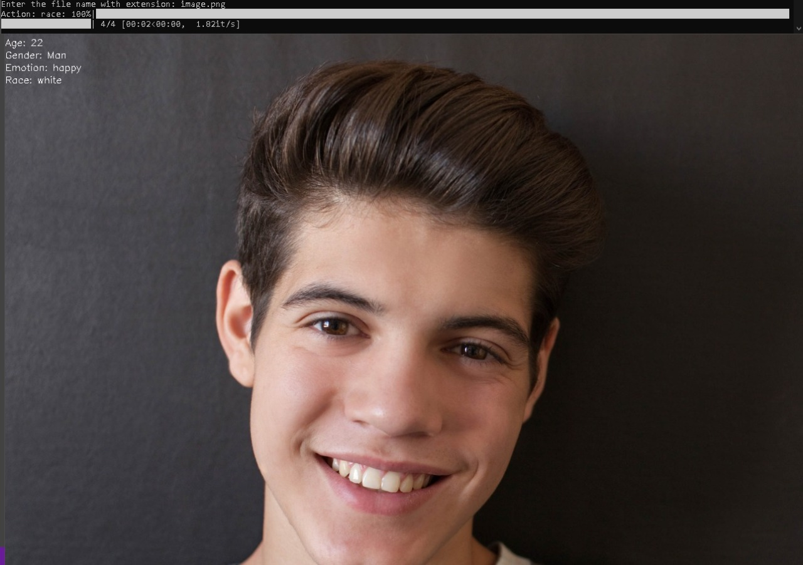

# src
Detects the age, gender, race  and emotion from the image

## Installation
### Requirements
Install the following modules
```bash
pip install opencv-python
```

```bash
pip install deepface
```

## Usage
- `Deepface` is a lightweight face recognition and facial attribute analysis (age, gender, emotion and race) framework for python. It is a hybrid face recognition framework wrapping state-of-the-art models: VGG-Face, Google FaceNet, OpenFace, Facebook DeepFace, DeepID, ArcFace and Dlib.
- `OpenCV` is a great tool for image processing and performing computer vision tasks. It is an open-source library that can be used to perform tasks like face detection, objection tracking, landmark detection, and much more.

## Code
Basic Libraries
```bash
from deepface import DeepFace
import cv2 as cv
```

Get file name from user and read the file using `OpenCV`
```bash
image_name = input("Enter the file name with extension: ")
readed_img = cv.imread(image_name)
```

Analyze Age, Gender, Race using `DeepFace.analyze()`
```bash
analysis = DeepFace.analyze(readed_img, actions = ["age", "gender", "emotion", "race"])
```

```bash
from deepface import DeepFace
import cv2 as cv

image_name = input("Enter the file name with extension: ")
readed_img = cv.imread(image_name)

analysis = DeepFace.analyze(readed_img, actions = ["age", "gender", "emotion", "race"])

font = cv.FONT_HERSHEY_SIMPLEX
cv.putText(readed_img,"Age: "+str(analysis['age']),(0,20),font,0.5,(255,255,255),1)
cv.putText(readed_img,"Gender: "+str(analysis['gender']),(0,40),font,0.5,(255,255,255),1)
cv.putText(readed_img,"Emotion: "+str(analysis['dominant_emotion']),(0,60),font,0.5,(255,255,255),1)
cv.putText(readed_img,"Race: "+str(analysis['dominant_race']),(0,80),font,0.5,(255,255,255),1)
cv.imshow('image', readed_img)
cv.waitKey(0)
cv.destroyAllWindows()
```

## Demo




